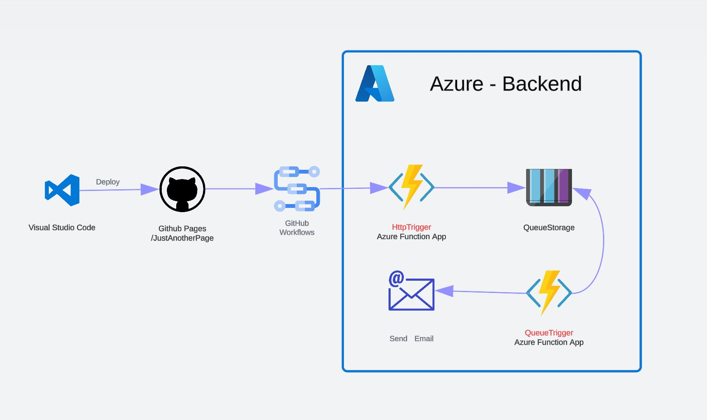

## Available Scripts

In the project directory, you can run:

### `npm start`

Runs the app in the development mode.\
Open [http://localhost:3000](http://localhost:3000) to view it in your browser.

The page will reload when you make changes.

## Requirements for deployment on GitHub Pages with React
See the section about [deployment](https://create-react-app.dev/docs/deployment/#github-pages) for more information.

## Deploy App with GitHub Pages

### `npm run deploy`

Builds the app for production to the `build` folder.\
It correctly bundles React in production mode and optimizes the build for the best performance.

The build is minified and the filenames include the hashes

## Architecture diagram

I did not use an API as a backend since it seems too much for the purpose and not to mention that with the API you are limited to 60 minutes of computing time per day.

## Learn More

You can learn more in the [Create React App documentation](https://facebook.github.io/create-react-app/docs/getting-started).

To learn React, check out the [React documentation](https://reactjs.org/).

Read more about [Azure Storage Account](https://learn.microsoft.com/en-us/azure/storage/common/storage-account-overview).

Read more about [Azure Queue Storage](https://learn.microsoft.com/en-us/azure/storage/queues/storage-queues-introduction).

Read more about [Azure Functions](https://learn.microsoft.com/en-us/azure/azure-functions/functions-overview?pivots=programming-language-csharp).

Read more about [GitHub Actions](https://docs.github.com/en/actions/quickstart)